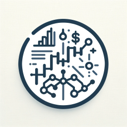

# Project (중단)
<p align="center">
    
</p>

This project aims to develop algorithmic trading models that crawl news articles to predict and trade the direction of stocks and financial instruments.
It also aims to utilize the [LangChain-ai](https://github.com/langchain-ai) and [Transformers(HuggingFace)](https://github.com/huggingface/transformers)models to deeply analyze linguistic data from the financial domain and detect inefficiencies in the market.

For additional information, please refer to the [한글 문서](assets/README_KO.md) and [Team Notion](https://www.notion.so/yb98/097de26b8c5f4b5c83a4cd5b18c78103).

## Key Features
- **Analyze the causes of price fluctuations**: Infer the causes of price fluctuations in your holdings from analyst reports, electronic disclosures, and news data, and automatically report them.
- **Real-time data collection and ultra-short-term trading**: Collect analyst reports, electronic disclosures, and news data in real-time to execute ultra-short-term directional trading strategies.

This project aims to use advanced natural language processing (NLP) techniques to reduce information asymmetries in financial markets and maximize the performance of quantitative trading strategies.

## 진행 완료
### 1. 'FinanceNewsList' (뉴스 목록 크롤러)

- **목적**: 'kosdaq.csv'에 정의된 코스닥 종목들의 뉴스 목록 수집
- **수집 항목**: 제목, URL, 언론사, 날짜, cluster ID(관련 기사)
- **결과 저장**: 'ArticleItem' -> 'ArticleOrm' 테이블

### 2. 'NewsContents' (뉴스 본문 크롤러)
- **목적**: 'ArticleOrm' 테이블에 저장된 URL로부터 기사 본문 수집
- **수집 항목**: 제목, 본문, 작성일, 수정일
- **결과 저장**: 'ArticleContentItem' -> 'ArticleContentOrm' 테이블

### 3. PipleLine 구성
- FinanceNewsListPipeLine' : 기사 목록을 'ArticleOrm' 테이블에 저장
- FinanceNewsContentPipeline' : 기사 본문을 압축하여 저장 및 상태 업데이트
- FinanceNewsListLastYearPipeline' : 작년 기사 처리용

### 4. Korean NLP with Transformers
- **목표 1**: 한국어 뉴스 기사 데이터를 이용한 감성 분석
- **목표 2**: HuggingFace Transformers 라이브러리를 사용하여 텍스트 분류 모델 훈련 및 평가.
- **주요 작업**
    - 감성 라벨링이 된 뉴스 데이터 전처리
    - 텍스트 정규화 및 형태소 분석
    - 학습/테스트용 데이터셋 생성
    - Tokenization 및 데이터셋 변환
    - Trainer API를 통한 모델 fine-tuning
- [분석 내용 발표 ppt](https://docs.google.com/presentation/d/1UStfwBIhBEBADKbSndv1aXGBpA9fA6F9iNscCXQPmcQ/edit?usp=sharing)

## Usage
```bash
poetry install
poetry shell

# 반드시 datasets/articles.db 를 먼저 생성해야함
alembic upgrade head

# TASK1: 네이버 뉴스 링크 리스트를 datasets/articles.db 에 저장
scrapy crawl naver_news_content

# TASK2: 저장된 네이버 뉴스 링크 리스트에서 하나씩 뉴스 본문 파싱
scrapy crawl naver_news_list
```

## Scrapy-extension
- [scrapy-fake-agent](https://github.com/alecxe/scrapy-fake-useragent)
- [scrapy-playwright](https://github.com/scrapy-plugins/scrapy-playwright)

## html compression algorithm

The crawled HTML code is stored as binary, compressed using the `lzma` algorithm. [Simple tests](https://chat.openai.com/share/a0a256b4-6e04-4920-8f4e-7b7285977476) showed that among `lz4`, `gzip`, `bz2`, and `lzma`, `lzma` had the best compression ratio. Compression time was not considered.